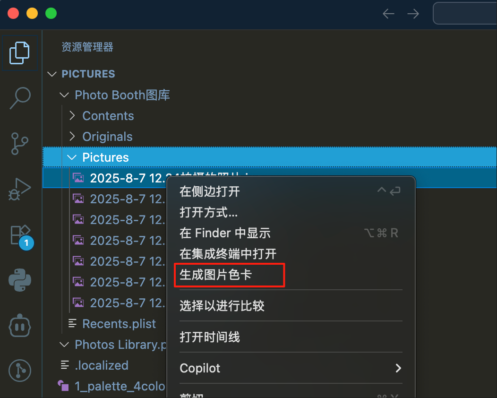
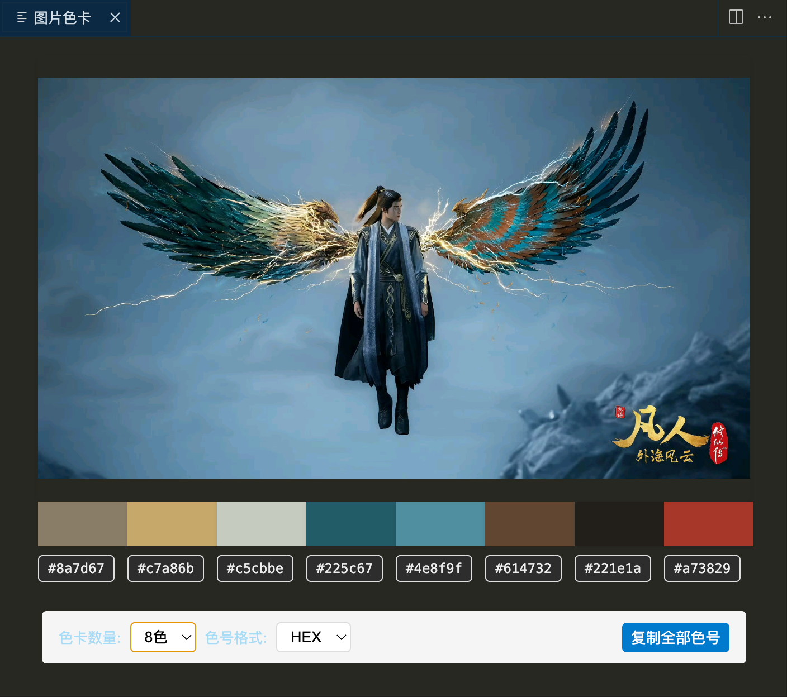
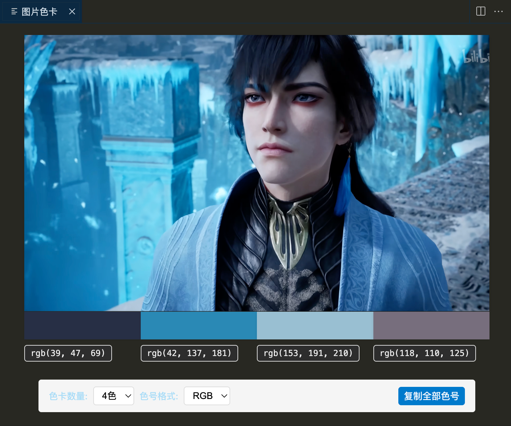

# 图片色卡提取工具

一款 VS Code 扩展，可以从图片中提取主色调并生成色卡，支持复制色号到剪贴板。

## 功能特性

- 从图片中自动提取 4-8 种主色调
- 支持显示 HEX 和 RGB 两种色号格式
- 点击色卡或文字可复制对应色号
- 一键复制所有色号功能
- 支持 PNG/JPG/JPEG/GIF/WEBP/BMP/SVG 格式

## 使用方法

1. 在 VS Code 资源管理器中右键点击图片文件
2. 选择"生成图片色卡"选项
3. 右侧将打开一个面板显示图片和提取的色卡
4. 点击色卡或色号文字可复制到剪贴板
5. 点击"复制全部色号"按钮可复制所有色号

## 效果截图

## 快捷键

- 在资源管理器中对图片右键选择"生成图片色卡"

## 开发信息

开发者: Xin

## 许可证

MIT License
